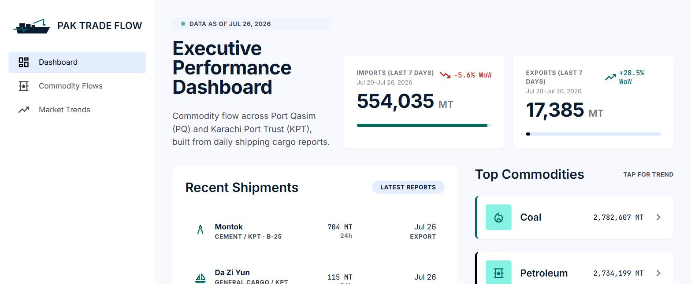
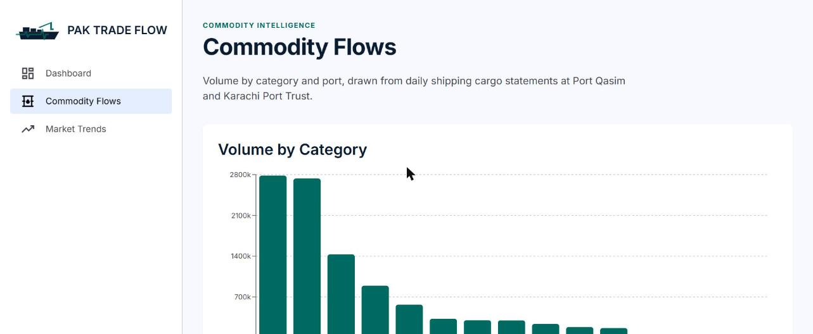
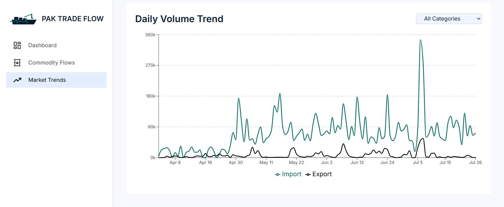

# PAK Trade Flow

**A commodity flow & trade intelligence dashboard for Pakistan's two major deep-water ports — Port Qasim (PQ) and Karachi Port Trust (KPT).**

## What it does & the problem it solves

Every day, Port Qasim and Karachi Port Trust each publish their own raw cargo statements — daily tonnage PDFs and outer-anchorage Excel sheets listing every vessel, its cargo, and whether it's importing or exporting. That data exists, but nobody can *see* it: it's scattered across dozens of per-day files, in inconsistent formats, with no unified view of what's actually moving through the country's ports.

**PAK Trade Flow** turns that raw daily paperwork (already parsed and loaded into a Postgres database by a companion ETL pipeline) into a single, live, queryable dashboard. It answers the questions a trade analyst, logistics planner, or port operations stakeholder actually has:

- What commodities dominate import/export volume right now, and how is that shifting week to week?
- Is a given port import-heavy or export-heavy, and by how much?
- Which terminal at Port Qasim is handling the most cargo?
- How has daily volume for a specific commodity (coal, petroleum, LPG, etc.) trended over the last few months?

**Who it's for:** trade/logistics analysts, port operations teams, and anyone who needs a fast, real-numbers read on Pakistan's maritime commodity flow without manually reading PDFs.

## Live Demo


**[ 🔗 https://pak-trade-flow.vercel.app/ ]**

## Features

**Dashboard** (`/`)
- Executive KPIs: total import & export volume for the **trailing 7 days**, with week-over-week and month-over-month % change, clearly labeled with the exact date range. MoM compares the same 7-day window against the equivalent week four weeks back, so it's a same-length comparison rather than a week measured against a full month
- Live "Data as of" freshness badge showing the latest report date in the database
- Top Commodities — every category with real reported volume, **each one clickable**, jumping straight to that category's trend on the Market Trends page
- Recent Shipments feed — the latest real vessel calls (ship name, commodity, port/terminal, tonnage, import/export)
- Animated count-up numbers on all KPI cards

**Commodity Flows** (`/commodity-flows`)
- Volume-by-category bar chart across all 13+ tracked commodity categories (coal, petroleum, LPG/LNG, oilseeds, edible oil, containers, cement, chemicals, steel, and more)
- Import vs Export split, compared side-by-side for KPT and Port Qasim
- Port Qasim terminal drill-down (PIBT, FAP, FOTCO, M/W, HFP&S, etc.), with an honest data-quality note when a large share of rows have no terminal recorded

**Market Trends** (`/market-trends`)
- Daily volume trend line chart spanning the full data history
- Toggle between "All Categories" and any single commodity — **both Import and Export lines are always shown and color-coded**, so direction is never lost even when drilling into one commodity
- Deep-linkable via `?category=` — the Dashboard's commodity links land here pre-filtered
- 7-day import/export volume stat cards with WoW and MoM % change

**Lead capture & access gating** (`components/gating/`)
- The Recent Shipments feed shows the **first 2 rows free** — enough to prove the data is real — then blurs the rest behind an "Unlock Access" overlay. The Market Trends chart is gated the same way
- A form collects name, work email, primary commodity interest (the lead-qualification signal), an optional message, and an opt-in for the weekly AI briefing. Submissions POST to `/api/lead`, which forwards them to a Google Apps Script webhook that appends to a spreadsheet
- Unlock state persists in `localStorage`; the same form powers `/contact` via `/api/contact`
- **This is a marketing gate, not access control.** The gated rows are already in the server-rendered HTML and merely blurred with CSS, so anyone reading the page source can see them. It exists to convert visitors, not to protect data.

**AI Weekly Trade Briefing**
- A short weekly narrative of commodity flow, generated from code-computed figures and emailed to subscribers. See [the section below](#ai-feature-weekly-trade-briefing) for the architecture, and `docs/sample-briefing.md` for a real generated example

**Design**
- Custom Material Design 3–inspired theme (colors, type scale, spacing) ported from the original Stitch design mockups
- Branded animated ship/pulse-line logo, hand-built as an SVG React component
- Fully server-rendered with hourly data revalidation (no stale client-side caching)

## AI Feature: Weekly Trade Briefing

A short, human-readable narrative summary of the week's commodity flow, written by an LLM (**DeepSeek**) from the same aggregated data the Dashboard already computes server-side — the kind of two-sentence briefing a busy port official can read in five seconds instead of interpreting charts.

It is delivered as a **weekly email to subscribers**, not rendered in the app: visitors opt in via the "Email me the weekly AI trade briefing" checkbox on the lead-capture modal and contact form, which turns a one-shot email capture into a recurring touchpoint.

A real generated example — the email body, plus a table of every figure behind it — is checked in at **`docs/sample-briefing.md`**, with `docs/sample-briefing.html` showing it rendered as the email actually arrives.

### The LLM never produces a number

The one unacceptable failure here is a hallucinated tonnage figure going out by email under the project's name. So the model is not trusted with arithmetic at any point:

1. **Code computes every figure.** `buildBriefingFacts()` (`lib/data/commodityFlow.ts`) assembles a `BriefingFacts` object from the existing `getHeroKpis` / `getCategoryTotals` / `getPortComparison` aggregators, scoped to the same trailing-7-day window the Dashboard KPIs use.
2. **Code computes every comparison too.** Correct figures are not sufficient — asked to compare them, the model states relationships backwards while every individual number still checks out (an early run produced *"more export calls (20) than Port Qasim (32)"*). So `buildRelationships()` works out every valid comparison in advance and the prompt forbids the model from making any others.
3. **The model only writes prose.** It receives figures pre-formatted (`1,243,891 MT`) so that copying them is easier than restating them.
4. **The output is validated back against the facts.** Two gates in `lib/ai/briefing.ts`: `validateBriefingNumbers()` requires every tonnage and percentage claim to trace to a real value within a rounding tolerance, and `validateComparativeClaims()` checks that any "higher/lower/more/fewer … than …" assertion actually holds between the two numbers named. A failure triggers one corrective retry, then a deterministic non-AI fallback.
5. **The email always sends.** If the model is unreachable, out of credit, or fails validation twice, `buildFallbackBriefing()` produces a plainer briefing from the same facts. The response records which path ran (`source: "ai" | "fallback"`), and `validationIssues` always explains a fallback.

### System prompt

```
You are a trade-intelligence analyst writing a short weekly briefing for
port operations stakeholders at Port Qasim and Karachi Port Trust.

You will be given structured JSON with this week's and last week's total
import/export volume (metric tons), the top commodity categories by
volume, and the import/export split per port. Using ONLY the numbers
provided:

- Write 2-4 sentences, plain language, no jargon.
- Lead with the single most notable change (a WoW swing, a new top
  commodity, a port imbalance shift).
- State figures with their units (MT) and time period explicitly.
- Never speculate beyond the given data — if a figure isn't in the input,
  do not mention it.
- Note explicitly if a number may be undercounted due to partial 24h
  tonnage reporting (this will be flagged in the input when relevant).
- Do not use superlatives ("massive", "huge") — state the percentage or
  volume change plainly instead.
- Copy the PERIOD label exactly as written. Do not reformat or restate the
  dates in any other way.

Output plain text only, no markdown, no headings.
```

### How it runs

```
Weekly trigger  →  POST /api/briefing/dispatch   (requires BRIEFING_CRON_SECRET)
                       ├─ getAllCommodityFlow()      existing hourly-cached fetch
                       ├─ buildBriefingFacts()       existing aggregators
                       ├─ generateBriefing()         DeepSeek → validate → retry → fallback
                       └─ forwardLead({ action: "weekly-briefing", … })
                                └─ Google Apps Script → mails opted-in subscribers
```

Generation is cached for a week keyed on the briefing period, so a retried or duplicated trigger reuses the text instead of paying for another generation. Pass `?force=1` to regenerate while testing.

The scheduler is an Apps Script time-driven trigger (`docs/apps-script/sendWeeklyBriefing.gs`), which works regardless of where the app is hosted. Once deployed to Vercel, a `vercel.json` `crons` entry can drive the same endpoint instead.

**Testing it locally:** leave `LEAD_WEBHOOK_URL` unset and nothing is mailed — `forwardLead` logs a warning and no-ops, while the response body still returns the full briefing and the facts behind it.

```bash
curl -X POST "http://localhost:3000/api/briefing/dispatch?force=1" \
  -H "Authorization: Bearer $BRIEFING_CRON_SECRET"
```

No AI SDK is used — the API is OpenAI-compatible, so `lib/ai/deepseek.ts` is a small `fetch` wrapper and the feature adds **zero npm dependencies**.

### Provider configuration

The same DeepSeek models are reachable directly or through an OpenAI-compatible gateway, and `DEEPSEEK_BASE_URL` selects which. Both providers issue keys beginning `sk-`, so the base URL and model must match the key:

| | Native DeepSeek | OpenRouter |
|---|---|---|
| Key shape | `sk-` + 32 hex | `sk-or-v1-` + 64 hex |
| `DEEPSEEK_BASE_URL` | `https://api.deepseek.com` (default) | `https://openrouter.ai/api/v1` |
| `DEEPSEEK_MODEL` | `deepseek-chat` | `deepseek/deepseek-chat` |

Sending an OpenRouter key to `api.deepseek.com` returns a bare `401 Authentication Fails`, which reads like a bad key rather than a misrouted one — so `lib/ai/deepseek.ts` detects that combination up front and fails with an explanatory message instead.

## Tools, Services & AI Models Used to Build This

| Category | Choice |
|---|---|
| AI pair-programmer | **Claude Code** — Sonnet 5 for the original dashboard build (architecture, data layer, UI components, this README), Opus 5 for the AI briefing feature |
| In-product AI | **DeepSeek** (`deepseek-chat`) — writes the weekly trade briefing from code-computed figures, called over its OpenAI-compatible REST API with no SDK. Reachable directly or via OpenRouter; see [Provider configuration](#provider-configuration) |
| Email delivery | **Google Apps Script** + `MailApp`, driven by a weekly time-based trigger |
| Framework | **Next.js 14** (App Router, Server Components, TypeScript) |
| Styling | **Tailwind CSS**, custom design tokens, Google Fonts (Inter, JetBrains Mono, Material Symbols Outlined) |
| Charts | **Recharts** |
| Database / Backend | **Supabase** (hosted Postgres + PostgREST), queried server-side only via `@supabase/supabase-js` with a service-role key |
| Data source | A companion ETL pipeline that parses daily PQ/KPT cargo PDFs & spreadsheets into the `commodity_flow` Postgres table this app reads |
| Hosting (build/dev) | Local Node.js dev server (deployment target TBD — see Live Demo) |

## Screenshots

**Dashboard** — executive KPIs, recent shipments, and clickable top commodities


**Commodity Flows** — volume by category and port-level import/export comparison


**Market Trends** — daily volume trend with Import/Export always distinguished


## How to Run This Project

### Prerequisites
- Node.js 18+ and npm
- A Supabase project with a `commodity_flow` table (see schema below) populated with data, and its **service_role** key (Project Settings → API)

### Setup

```bash
# 1. Install dependencies
npm install

# 2. Configure environment variables
cp .env.example .env.local
```

Edit `.env.local`:

```
SUPABASE_URL=https://<your-project-ref>.supabase.co
SUPABASE_SERVICE_ROLE_KEY=<your-service-role-key>

# Optional — lead capture and weekly briefing delivery
LEAD_WEBHOOK_URL=<your Google Apps Script Web App URL>

# Optional — AI weekly trade briefing (see "Provider configuration" above)
DEEPSEEK_API_KEY=<your API key>
DEEPSEEK_BASE_URL=https://api.deepseek.com
DEEPSEEK_MODEL=deepseek-chat
BRIEFING_CRON_SECRET=<random 32-byte hex string>
```


> `DEEPSEEK_API_KEY` and `BRIEFING_CRON_SECRET` are likewise server-only. The app runs fine without them — only `/api/briefing/dispatch` needs them, and it rejects every request when the secret is unset.

```bash
# 3. Run the dev server
npm run dev
```

Open **http://localhost:3000**.

```bash
# Production build
npm run build
npm start
```

### Expected `commodity_flow` schema

| Column | Type | Notes |
|---|---|---|
| `id` | integer | primary key |
| `report_date` | date | |
| `port` | text | `PQ` or `KPT` |
| `ship_name` | text | |
| `commodity` / `commodity_standard` / `commodity_category` | text | raw name, standardized name, category |
| `weight_mt` | numeric | manifest quantity |
| `weight_24h_mt` | numeric, nullable | 24h-window tonnage — only ~33% populated for PQ, 100% for KPT |
| `imp_exp` | text | `Import` or `Export` |
| `terminal` | text, nullable | PQ only |

## Known Data Limitations

Being transparent about this since it shapes several design decisions in the app:

- **Partial 24h coverage**: `weight_24h_mt` (used for all volume sums, to avoid double-counting vessels across multiple berthed days) is only populated on ~33% of Port Qasim rows vs. 100% of KPT rows. Totals reflect *reported* volume, not necessarily total physical volume. The weekly briefing computes this shortfall per period and states it outright when it crosses a threshold, so the caveat travels with the numbers rather than living only here.

